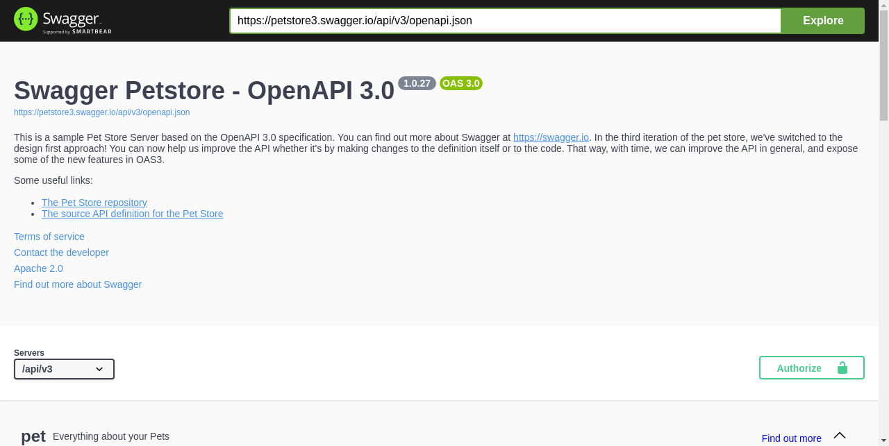
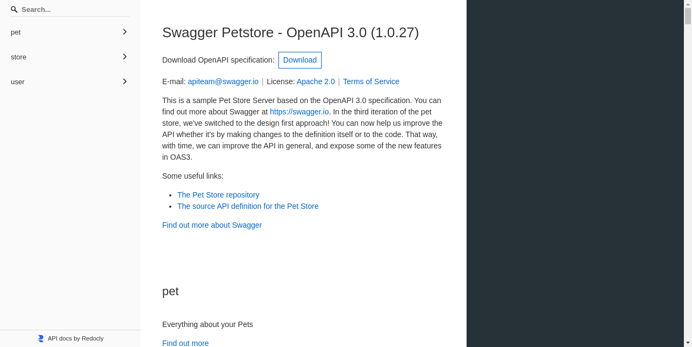
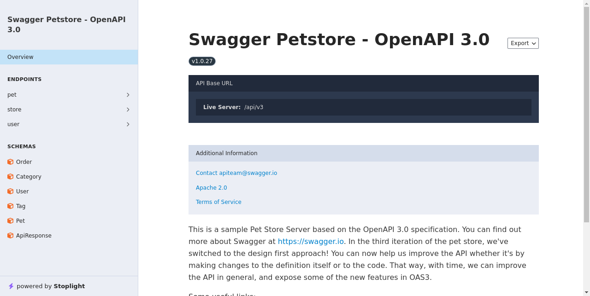
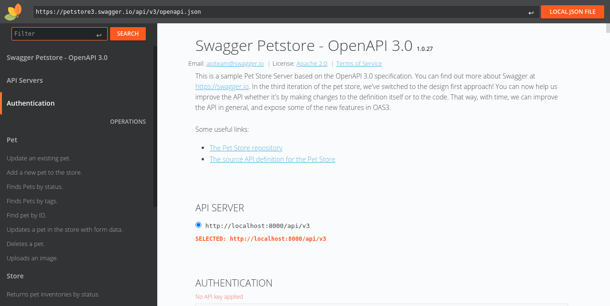
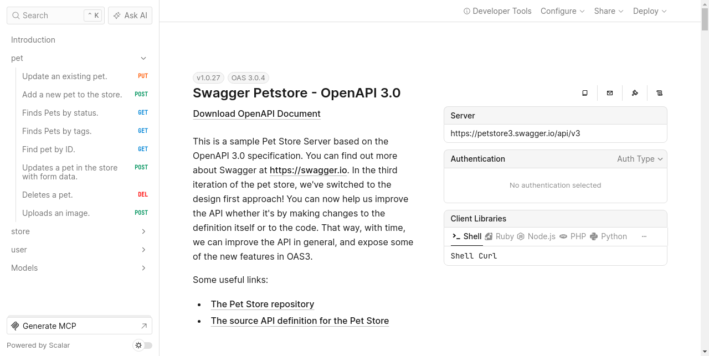
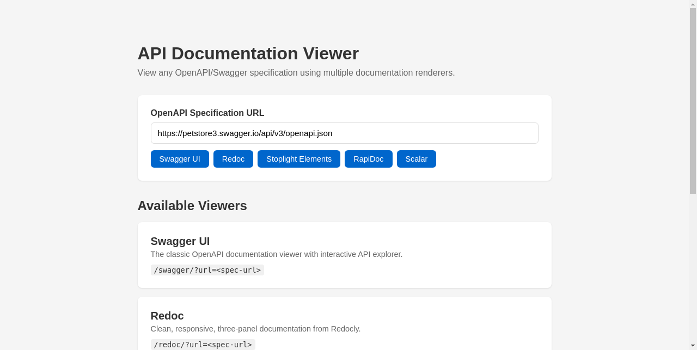

<h1 align=center>Dockette / Apidoc</h1>

<p align=center>
   Dockerized OpenAPI documentation viewer. Swagger UI, Redoc, Stoplight Elements, RapiDoc and Scalar in one image.
</p>

<p align=center>
  <a href="https://hub.docker.com/r/dockette/apidoc/"></a>
  <a href="https://bit.ly/ctteg"></a>
  <a href="https://github.com/sponsors/f3l1x"></a>
</p>

------

## Prologue

Docker image bundling multiple OpenAPI/Swagger documentation renderers. Point any viewer at your spec via `?url=` parameter. All assets are bundled locally, no CDN calls at runtime.

## Viewers

<table>
  <tr>
    <th colspan="3">Swagger UI</th>
  </tr>
  <tr>
    <td colspan="3"></td>
  </tr>
  <tr>
    <td><code>/swagger/?url=&lt;spec&gt;</code></td>
    <td>Classic interactive API explorer</td>
    <td><a href="https://swagger.io/tools/swagger-ui/">swagger.io</a></td>
  </tr>
  <tr>
    <th colspan="3">Redoc</th>
  </tr>
  <tr>
    <td colspan="3"></td>
  </tr>
  <tr>
    <td><code>/redoc/?url=&lt;spec&gt;</code></td>
    <td>Clean, responsive, three-panel documentation</td>
    <td><a href="https://redocly.com/redoc">Redocly</a></td>
  </tr>
  <tr>
    <th colspan="3">Stoplight Elements</th>
  </tr>
  <tr>
    <td colspan="3"></td>
  </tr>
  <tr>
    <td><code>/elements/?url=&lt;spec&gt;</code></td>
    <td>Modern API documentation with try-it-out</td>
    <td><a href="https://stoplight.io/open-source/elements">Stoplight</a></td>
  </tr>
  <tr>
    <th colspan="3">RapiDoc</th>
  </tr>
  <tr>
    <td colspan="3"></td>
  </tr>
  <tr>
    <td><code>/rapidoc/?url=&lt;spec&gt;</code></td>
    <td>Web component based API docs with customizable themes</td>
    <td><a href="https://rapidocweb.com/">RapiDoc</a></td>
  </tr>
  <tr>
    <th colspan="3">Scalar</th>
  </tr>
  <tr>
    <td colspan="3"></td>
  </tr>
  <tr>
    <td><code>/scalar/?url=&lt;spec&gt;</code></td>
    <td>Beautiful, modern API reference</td>
    <td><a href="https://scalar.com/">Scalar</a></td>
  </tr>
</table>

### Landing Page



## Usage

```sh
docker run \
    --rm \
    -p 8000:8000 \
    dockette/apidoc
```

Then open:

- http://localhost:8000 — Landing page with all viewers
- http://localhost:8000/swagger/?url=https://petstore3.swagger.io/api/v3/openapi.json
- http://localhost:8000/redoc/?url=https://petstore3.swagger.io/api/v3/openapi.json
- http://localhost:8000/elements/?url=https://petstore3.swagger.io/api/v3/openapi.json
- http://localhost:8000/rapidoc/?url=https://petstore3.swagger.io/api/v3/openapi.json
- http://localhost:8000/scalar/?url=https://petstore3.swagger.io/api/v3/openapi.json

## Deployment

```yaml
services:
  apidoc:
    image: dockette/apidoc
    ports:
      - "8000:8000"
```

```sh
docker compose up
```

## Development

```sh
make build
make run
```

## Maintenance

See [how to contribute](https://github.com/dockette/.github/blob/master/CONTRIBUTING.md) to this package. Consider to [support](https://github.com/sponsors/f3l1x) **f3l1x**. Thank you for using this package.
