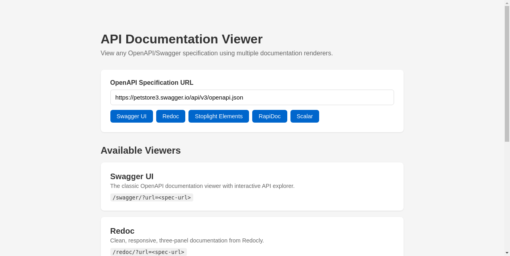
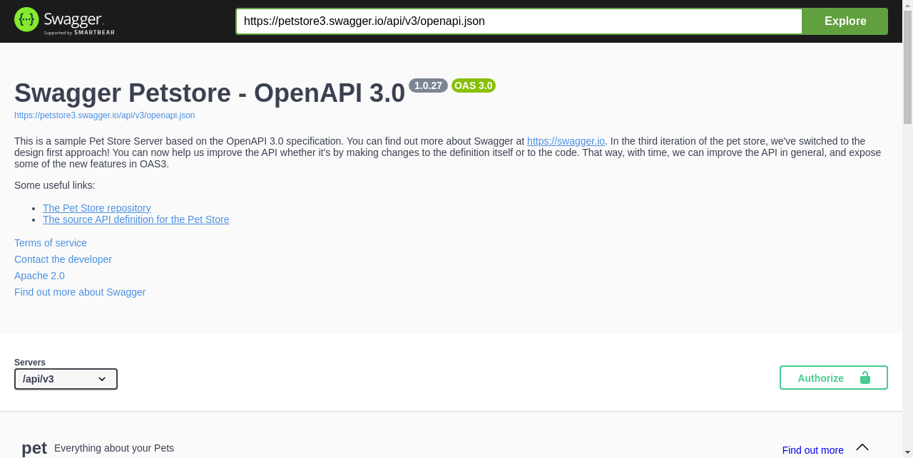
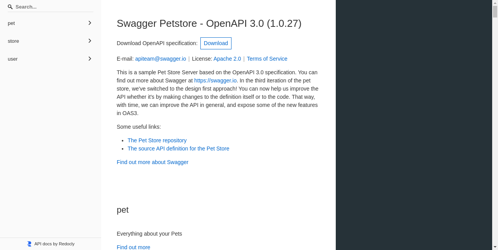
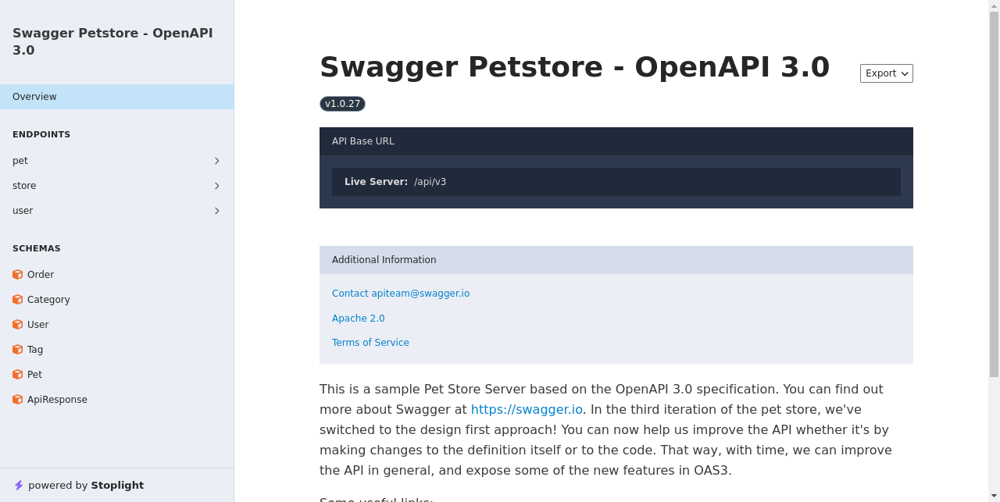
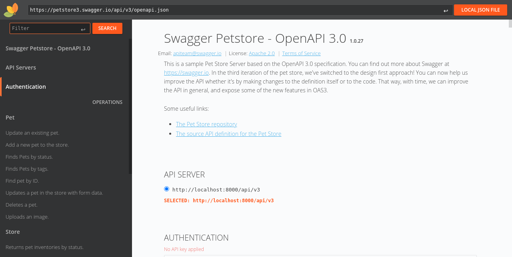
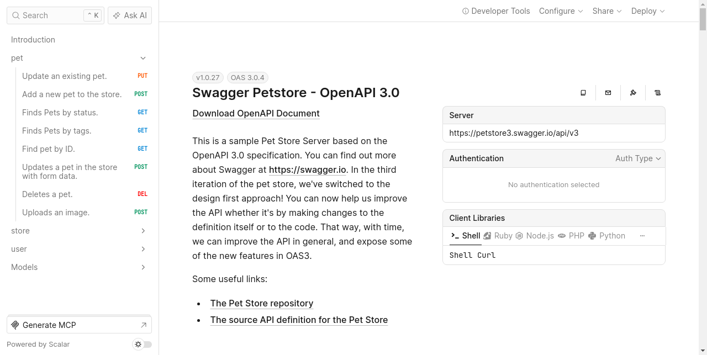

<h1 align=center>Dockette / Apidoc</h1>

<p align=center>
   <a href="https://github.com/dockette/apidoc/actions"></a>
   <a href="https://hub.docker.com/r/dockette/apidoc"></a>
   <a href="https://github.com/sponsors/f3l1x"></a>
   <a href="https://github.com/orgs/dockette/discussions"></a>
</p>

<p align=center>
   Five OpenAPI viewers in one Docker image: <a href="https://github.com/swagger-api/swagger-ui">Swagger UI</a>, <a href="https://github.com/Redocly/redoc">Redoc</a>, <a href="https://github.com/stoplightio/elements">Stoplight Elements</a>, <a href="https://github.com/rapi-doc/RapiDoc">RapiDoc</a> and <a href="https://github.com/scalar/scalar">Scalar</a>, served by Caddy on Debian Trixie. For developers who want to read an OpenAPI spec in the browser and compare viewers with one URL.
</p>

<p align=center>
   
</p>

-----

## Usage

Run the image on port `8000`:

```sh
docker run --rm -p 8000:8000 dockette/apidoc:latest
```

Based on `debian:trixie-slim` with Caddy. It needs no volume and no environment variable; open
`http://localhost:8000` and pick a viewer.

Every viewer takes the spec from the `url` query parameter. Open the Petstore spec in each one:

```text
http://localhost:8000/swagger/?url=https://petstore3.swagger.io/api/v3/openapi.json
http://localhost:8000/redoc/?url=https://petstore3.swagger.io/api/v3/openapi.json
http://localhost:8000/elements/?url=https://petstore3.swagger.io/api/v3/openapi.json
http://localhost:8000/rapidoc/?url=https://petstore3.swagger.io/api/v3/openapi.json
http://localhost:8000/scalar/?url=https://petstore3.swagger.io/api/v3/openapi.json
```

Without `url`, each viewer opens the Petstore spec. The viewer assets are served from the container, so the
browser loads no viewer code from a CDN.

> [!IMPORTANT]
> The browser fetches the spec, not the container. A spec on another host must send CORS headers that allow
> `http://localhost:8000`, or the viewer shows a load error.

## Local Spec

Caddy serves every file under `/srv/www`. Mount your spec there and open it by URL:

```sh
docker run --rm -p 8000:8000 \
    -v $(pwd)/openapi.yaml:/srv/www/openapi.yaml:ro \
    dockette/apidoc:latest
```

Then open `http://localhost:8000/redoc/?url=http://localhost:8000/openapi.yaml`, or any other viewer path.

## Compose

Start the service from the [`docker-compose.yml`](https://github.com/dockette/apidoc/blob/master/docker-compose.yml)
in this repository:

```yaml
services:
  apidoc:
    image: dockette/apidoc
    ports:
      - "8000:8000"
```

Then run:

```sh
docker compose up
```

> [!CAUTION]
> The container runs as root and serves plain HTTP with no authentication. Don't expose port `8000` to the
> internet; put a proxy with TLS in front of it.

## Viewers

### Swagger UI

The interactive API explorer from [Swagger UI](https://swagger.io/tools/swagger-ui/) `5.33.0`, at
`/swagger/?url=<spec>`.



### Redoc

A three-panel reference from [Redoc](https://redocly.com/redoc) `2.5.4`, at `/redoc/?url=<spec>`.



### Stoplight Elements

API docs with a sidebar and try-it requests from [Stoplight Elements](https://stoplight.io/open-source/elements)
`9.0.25`, at `/elements/?url=<spec>`.



### RapiDoc

A web component with try-it requests and authentication from [RapiDoc](https://rapidocweb.com/) `9.3.8`, at
`/rapidoc/?url=<spec>`.



### Scalar

An API reference with request examples from [Scalar](https://scalar.com/) `1.72.1`, at `/scalar/?url=<spec>`.



## Development

Build the image and run it on port `8000`:

```sh
make build
make run
```

The published tag is `dockette/apidoc:latest`, built for `linux/amd64` and `linux/arm64` and rebuilt every
Monday.

## Maintenance

See [how to contribute](https://github.com/dockette/.github/blob/master/CONTRIBUTING.md) to this package. Consider [supporting](https://github.com/sponsors/f3l1x) **f3l1x**. Thank you for using this package.
